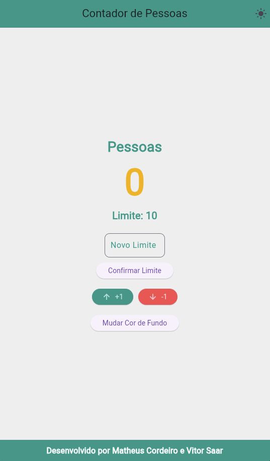

# Contador de Pessoas 🚶‍♂️🚶‍♀️

Aplicação Flutter que permite o controle do número de pessoas em um ambiente, evitando lotação acima do limite definido pelo usuário.  

## 📌 Funcionalidades
- ✅ Incrementar e decrementar contagem  
- ✅ Definir limite de pessoas  
- ✅ Modo claro e escuro  
- ✅ Alterar cor de fundo aleatoriamente  
- ✅ Exibir alerta quando o limite for excedido  

## 📲 Tecnologias Utilizadas
- Flutter  
- Dart 

## 📒 Matrícula dos integrantes da equipe

Matheus Cordeiro - 22217014
Vitor Saar - 122100011

